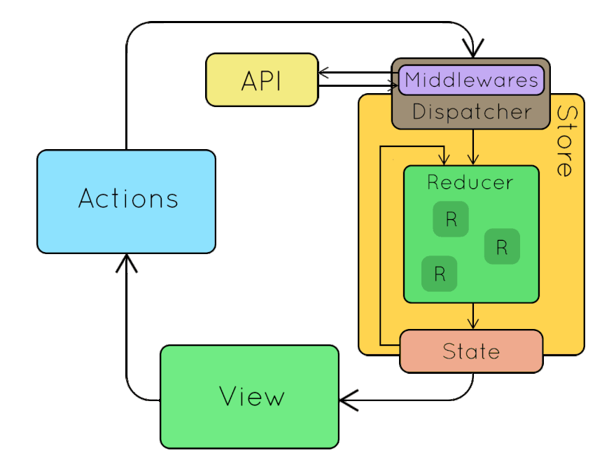

<h3>
  <span>State management:</span>
</h3>

**Что такое Flux?**

Flux - это архитектурный шаблон, который используется для управления состоянием веб-приложений. 
Он представляет собой односторонний поток данных, где данные идут от источника действия (Action) через диспетчер (Dispatcher) к хранилищу (Store), а затем визуализируются в представлениях (Views). 
Flux предлагает четкую организацию кода и предотвращает прямую мутацию состояния.

**Что такое Redux? Ключевые принципы Redux?**

Redux - это библиотека управления состоянием, основанная на идеях Flux. Она предназначена для приложений на JavaScript, особенно для тех, которые используют библиотеку React. Ключевые принципы Redux включают:

1. Единственный источник истины (Single Source of Truth): Состояние всего приложения хранится в одном объекте, называемом хранилищем (Store).
2. Состояние только для чтения (State is Read-Only): Состояние не может быть напрямую изменено. Единственным способом изменить состояние является создание и отправка действий (Actions).
3. Изменения состояния выполняются чистыми функциями (Changes are Made with Pure Functions): Изменения состояния описываются специальными функциями, называемыми редьюсерами (Reducers), которые возвращают новое состояние на основе предыдущего состояния и действий.

**Разница между Redux и Flux?**

Разница между Redux и Flux заключается в следующем:

1. Организация: Flux является архитектурным шаблоном, в то время как Redux - это конкретная библиотека.
2. Размер и сложность: Redux является более простой и легковесной библиотекой по сравнению с Flux.
3. Единственный контейнер состояния: В Redux существует единственное хранилище состояния для всего приложения, тогда как в Flux можно иметь несколько хранилищ состояния.
4. Неизменяемость состояния: Redux подразумевает неизменяемость состояния, тогда как Flux не делает таких предположений.

**Ключевые концепции Redux?**

Ключевые концепции Redux включают:
1.	**Хранилище (Store)**: Хранилище является центральным объектом в Redux, который содержит все состояние приложения. Оно представляет собой глобальный объект, который хранит данные и предоставляет методы для доступа к ним.

2.	**Действия (Actions)**: Действия представляют собой объекты, которые описывают, что произошло в приложении. Они должны иметь тип (type), который указывает, какое конкретное действие было выполнено. Действия могут содержать также дополнительные данные, необходимые для обновления состояния.

3.	**Редюсеры (Reducers)**: Редюсеры являются чистыми функциями, которые принимают предыдущее состояние и действие, и возвращают новое состояние. Они определяют, как должно изменяться состояние в ответ на конкретное действие. Каждый редюсер отвечает только за свою часть состояния и объединяется в корневой редюсер.

4.	**Корневой редюсер (Root Reducer)**: Корневой редюсер объединяет все редюсеры приложения и определяет, как будет выглядеть структура состояния. Он передается в хранилище при его создании.

5.	**Подписка (Subscription)**: Подписка позволяет компонентам приложения получать обновления состояния из хранилища. Когда состояние изменяется, хранилище уведомляет подписчиков, и компоненты могут обновиться в соответствии с новым состоянием.

6.	**Селекторы (Selectors)**: Селекторы являются функциями, которые позволяют получать определенные части состояния из хранилища. Они предоставляют удобный способ для извлечения данных из сложной структуры состояния и предоставления их компонентам приложения.

7.	**Мидлвары (Middleware)**: Мидлвары являются расширениями Redux, которые позволяют изменять поведение диспетчера действий. Они могут использоваться для добавления логирования, обработки асинхронных операций или преобразования действий перед их достижением редюсеров.

Понимание и использование этих ключевых концепций помогает в построении эффективной и масштабируемой архитектуры Redux-приложений.


**Что такое «единственный источник истины» (Single Source of Truth)?**

"Единственный источник истины" - это концепция в Redux, согласно которой состояние всего приложения хранится в одном объекте, называемом хранилищем (Store). Это означает, что все данные, необходимые для отображения и функционирования приложения, находятся в одном месте. Это облегчает отслеживание и управление состоянием приложения.

**Что такое редьюсер (Reducer)?**

**Редьюсер (Reducer)** - это чистая функция в Redux, которая принимает предыдущее состояние приложения и действие **(action)**, и возвращает новое состояние. Редьюсер определяет, как должно изменяться состояние приложения в ответ на конкретное действие.
В Redux, редьюсеры являются ключевым элементом для управления состоянием. Они определяют, как будут обрабатываться действия и как будет обновляться состояние приложения. Каждый редьюсер отвечает только за свою часть состояния и обрабатывает только те действия, которые относятся к этой части состояния.
Основные принципы редьюсеров в Redux:
**1.**	Чистые функции: Редьюсеры должны быть чистыми функциями, то есть они не должны иметь побочных эффектов и не должны изменять состояние напрямую. Они принимают только входные аргументы (предыдущее состояние и действие) и возвращают новое состояние.

**2.**	Неизменяемость состояния: Редьюсеры не мутируют предыдущее состояние, а создают и возвращают новый объект состояния. Это особенно важно для предсказуемости и отслеживаемости изменений состояния.

**3.**	Проверка типа действия: Редьюсеры обычно используют оператор switch или if/else для проверки типа действия. Они определяют, какое конкретное действие произошло и как обновить состояние в соответствии с этим действием.

**4.**	Обновление только соответствующей части состояния: Каждый редьюсер отвечает только за свою часть состояния и должен возвращать только эту часть. В итоге, состояние приложения объединяется в корневом редьюсере.

Пример редьюсера в Redux:

```javascript
const initialState = {
  counter: 0,
};

const counterReducer = (state = initialState, action) => {
  switch (action.type) {
    case 'INCREMENT':
      return { ...state, counter: state.counter + 1 };
    case 'DECREMENT':
      return { ...state, counter: state.counter - 1 };
    default:
      return state;
  }
};
```
Редьюсеры играют ключевую роль в изменении состояния приложения и обеспечивают предсказуемость и централизацию управления состоянием в Redux.


**Разница между React State и Redux State?**

React State (состояние React) и Redux State (состояние Redux) оба используются для управления состоянием в React-приложениях, но есть различия:

1. Локальность: React State является локальным для компонента, то есть каждый компонент может иметь свое собственное состояние. Redux State представляет собой глобальное состояние, которое доступно для всех компонентов в приложении.
2. Управление: React State управляется и обновляется непосредственно внутри компонента с помощью метода setState(). Redux State управляется через хранилище Redux и обновляется с помощью действий (Actions) и редьюсеров (Reducers).
3. Размер и сложность: Redux State обычно используется для управления состоянием приложений с более сложной логикой и большим объемом данных. React State обычно используется для локального состояния компонентов с простой логикой.

**Как выглядит поток данных в Redux-приложении?**

Поток данных в Redux-приложении следует однонаправленному циклу и выглядит следующим образом:

1. Действия (Actions): Взаимодействие пользователя или другие события в приложении генерируют действия. Действия являются объектами, содержащими информацию о произошедшем событии, такую как тип (type) и данные.
2. Диспетчер (Dispatcher): Действия отправляются в диспетчер, который является централизованным местом для обработки и передачи действий редьюсерам.
3. Редьюсеры (Reducers): Редьюсеры принимают предыдущее состояние и действие, и на основе них возвращают новое состояние. 4. Редьюсеры являются чистыми функциями и определяют, как происходят изменения состояния приложения.
4. Хранилище (Store): Хранилище содержит состояние всего приложения. Оно получает новое состояние от редьюсеров и управляет доступом к состоянию.
5. Представления (Views): Представления отображают данные из хранилища и реагируют на изменения состояния, обновляя себя. Представления могут также отправлять действия в диспетчер для инициирования изменений состояния.

**Плюсы и минусы Redux?**

Плюсы Redux:

1. Единственный источник истины: Использование единственного хранилища упрощает отслеживание и управление состоянием приложения.
2. Предсказуемость: Последовательный поток данных и чистые редьюсеры обеспечивают предсказуемость в изменении состояния.
3. Удобство отладки: Возможность записи и воспроизведения действий позволяет легко отлаживать и воспроизводить проблемы состояния приложения.
4. Расширяемость: Redux позволяет легко добавлять дополнительные функциональности, такие как средства маршрутизации или средства асинхронной обработки.

Минусы Redux:

1. Больше кода: Использование Redux требует дополнительного кода для определения действий, редьюсеров и хранилища, что может привести к увеличению объема кода приложения.
2. Сложность для простых приложений: В небольших и простых приложениях использование Redux может показаться избыточным и усложнять разработку.
3. Изучение: Понимание и освоение концепций и паттернов Redux может потребовать времени и усилий, особенно для разработчиков, не знакомых с архитектурой Flux.